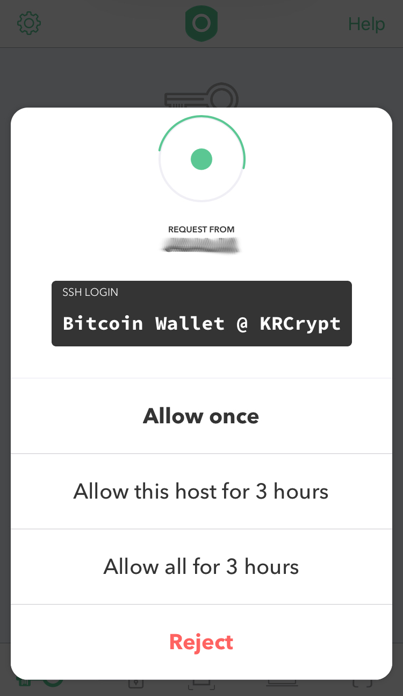

KRCrypt
===
A hacky proof of concept way to encrypt and decrypt files using [Krypton](https://krypt.co/).

Building
===
just run `npm i && npm run build`

Usage
===
kr daemon needs to be running (`kr restart`) and krd socket should be placed on the default path. (`$HOME/.kr/krd.sock`)

NOTICE: It only works with RSA key type.

- encryption: `node krcrypt.js encrypt [identifier] [file]`
- decryption: `node krcrypt.js decrypt [file]`

Examples
===
- to encrypt: `node krcrypt.js encrypt "Bitcoin Wallet" wallet.json`
- to decrypt: `node krcrypt.js decrypt wallet.json.krcrypted`

Both of those command will show a prompt like this on your device:

How does it work?
===
1. KRCrypt sends a fake ssh login request including the file identifier as username.
2. When you approve it, Krypton signs the ssh request and returns the signature.
3. The signature is used to derive the encryption Key and IV.
4. The Key and IV are used to encrypt your file.

Encryption
===
Files are encrypted using `id-aes256-GCM`, the key and iv are derived from the signature using `HMAC-SHA256`. I'm not a cryptographer but I'm pretty sure it's secure enough for most usages 
